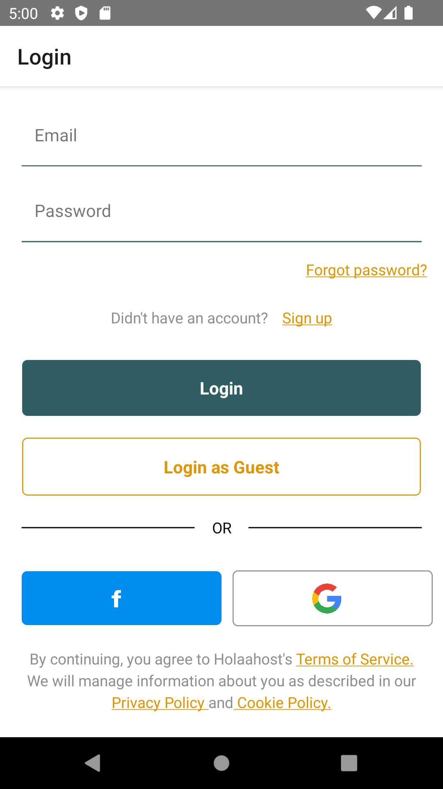
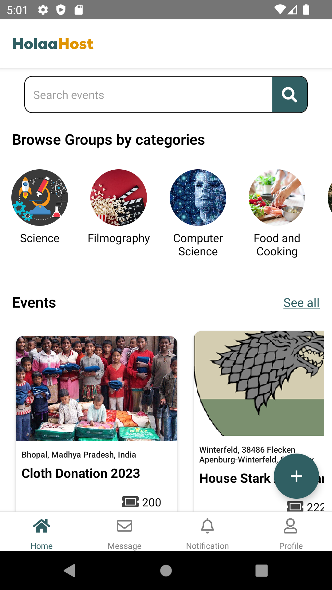
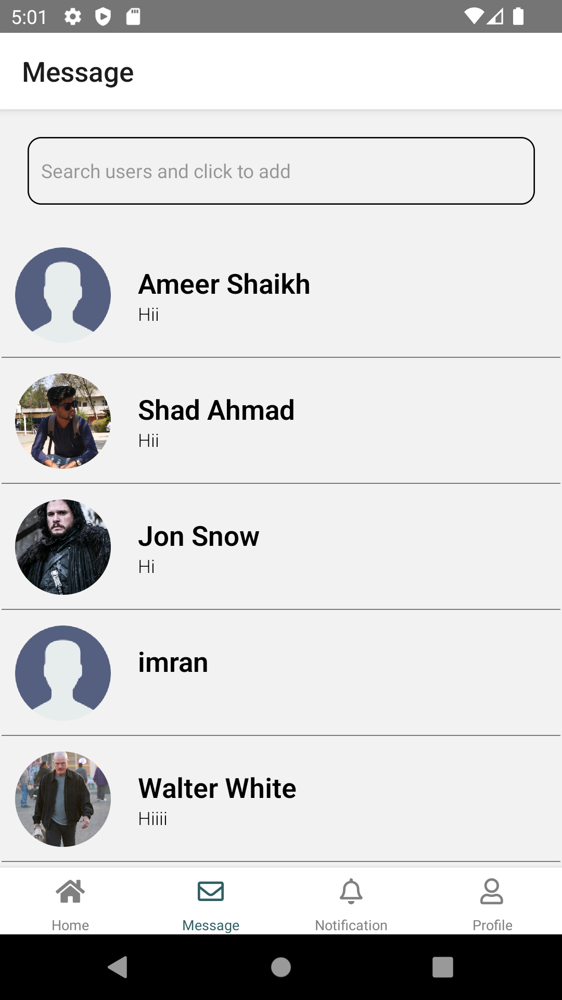
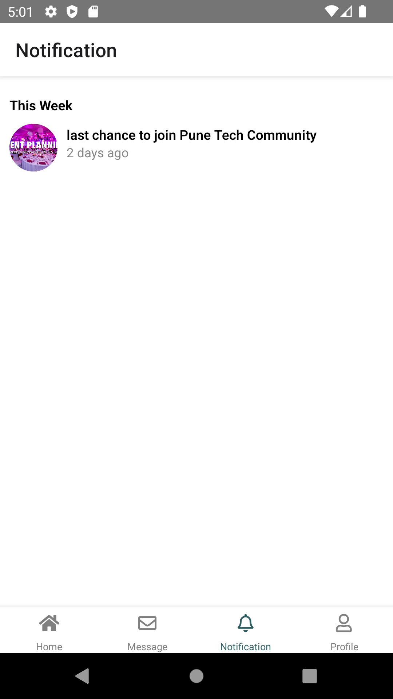
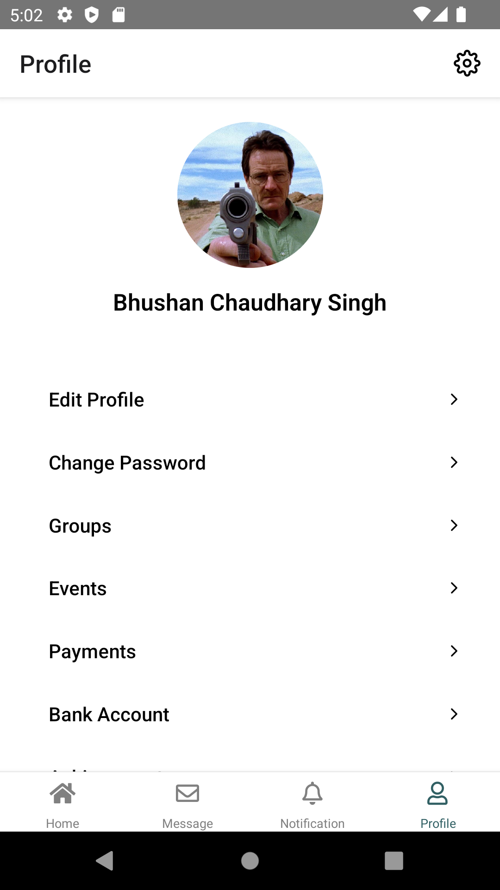
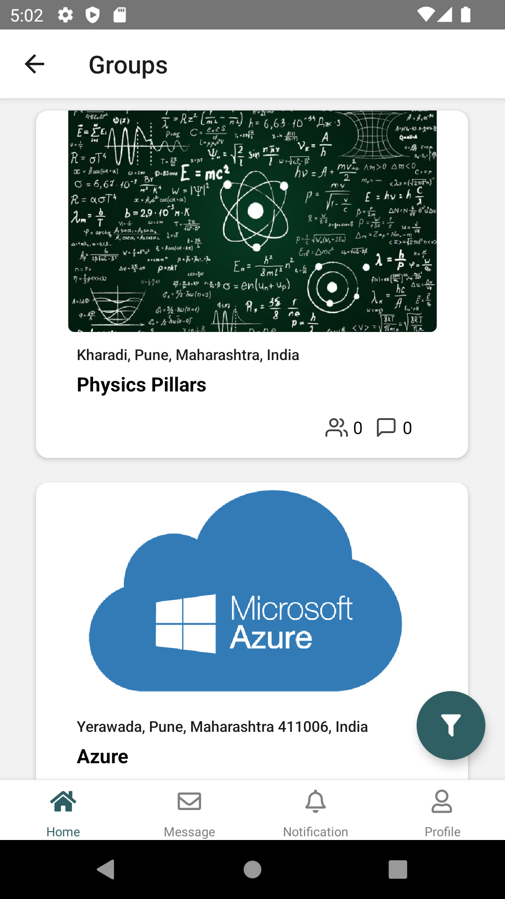
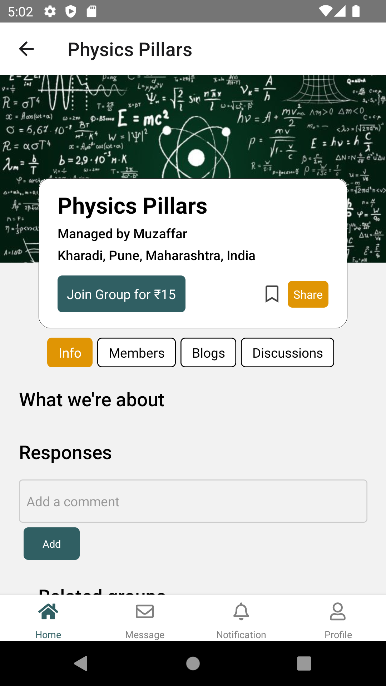

# HolaaHost App - Event booking mobile app ❤️

HolaaHost App is a platform that brings users together, allowing them to form groups based on shared interests and create niche-focused event groups.

## Installation

To get started with Holaahost App on your local machine, follow these simple steps:

1. **Clone the repository:**

   ```bash
   git clone https://github.com/shadahmad7/holaahosta-app.git

2. **Navigate to the project directory:**
 ```bash
   cd holaahost-app
```

3. **Install dependencies:**
 ```bash
  npm install
```

## Usage

After successfully installing the dependencies, you can run HolaaHost App on your local development enviroment using the following command:

 ```bash
  npx react-native run-android/ios 
```

This will launch and run a React Native application on an Android emulator or a physical Android device.

## Screenshots

Here are some screenshots to give you a sneak peek of our app:










## Contributing

If you'd like to contribute to Holaahost mobile app or report any issues, please check out our Contributing Guidelines.

## License

This project is licensed under the MIT License. See the LICENSE file for details.


